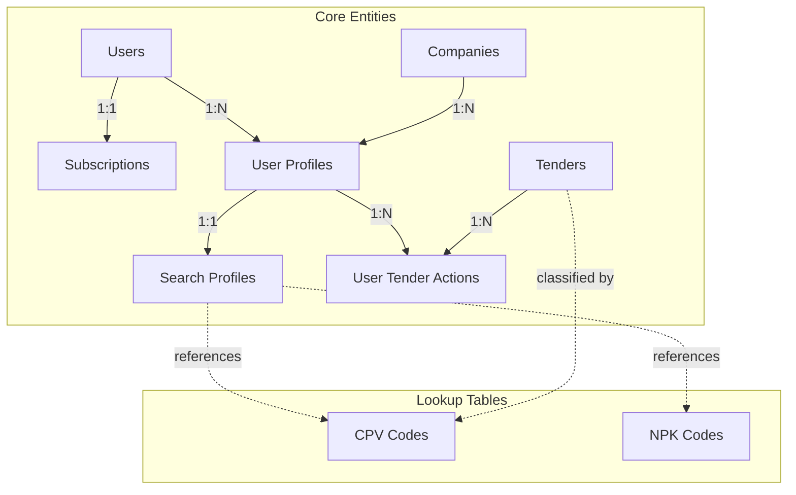
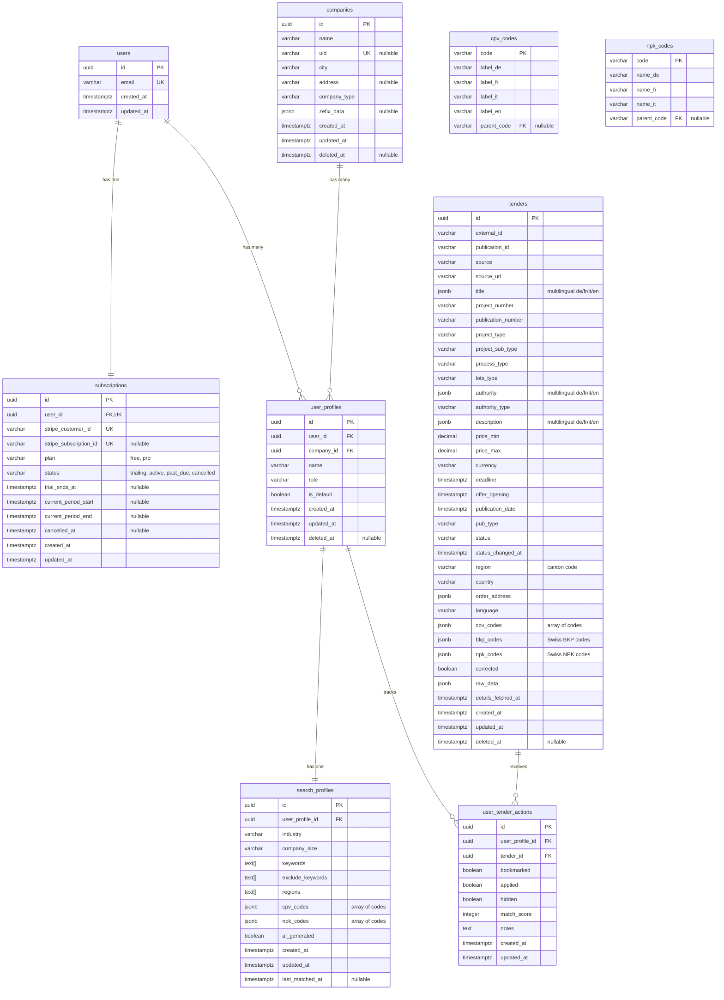
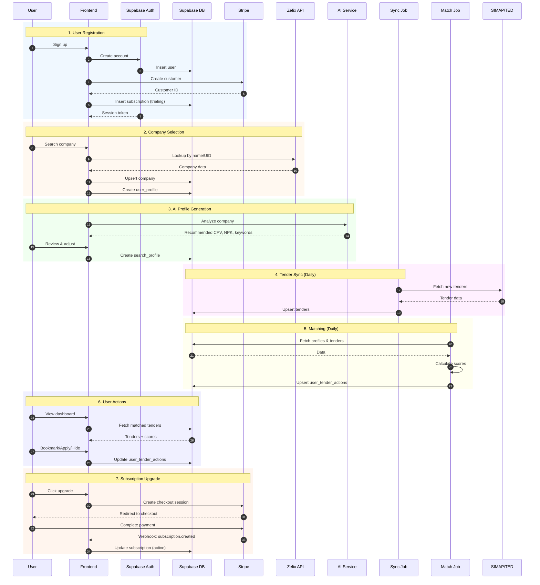
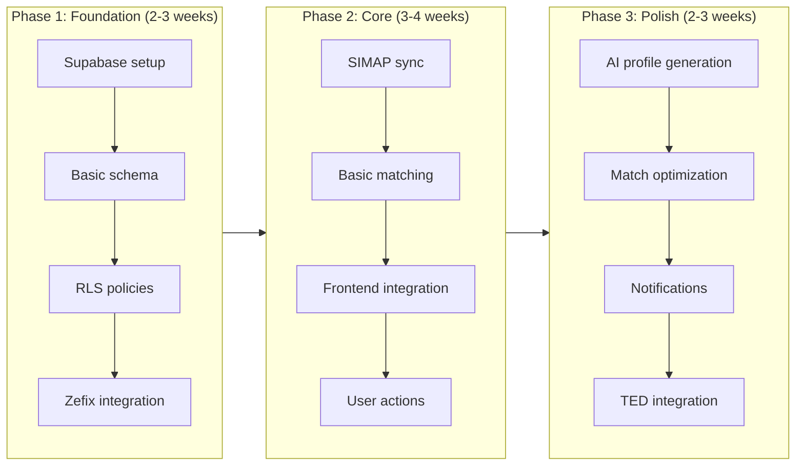

# Database Design - Tender Scout

## Overview

This document defines the data model for Tender Scout at three levels of abstraction:

| Level | Purpose | Contents |
|-------|---------|----------|
| **Conceptual** | Business view | Entity overview, high-level relationships |
| **Logical** | Design view | ERD with attributes, data types, keys, cardinality |
| **Physical** | Implementation view | Indexes, constraints, Supabase-specific configuration |

**Target Platform:** Supabase (PostgreSQL + Auth + Storage + Realtime)

---

## Conceptual Data Model

High-level business view of the data entities and their purpose.

| Entity | Type | Description |
|--------|------|-------------|
| **users** | Core | User accounts managed by Supabase Auth |
| **subscriptions** | Core | Stripe subscription status and billing (free/pro tiers) |
| **companies** | Core | Swiss companies identified via Zefix or manual entry |
| **user_profiles** | Core | Links users to companies with role information |
| **search_profiles** | Core | AI-generated or user-defined tender matching criteria |
| **tenders** | Core | Public procurement opportunities from SIMAP/TED |
| **user_tender_actions** | Core | Tracks user interactions and match scores |
| **cpv_codes** | Lookup | EU Common Procurement Vocabulary (hierarchical) |
| **npk_codes** | Lookup | Swiss construction standards (hierarchical) |

### High-Level Relationships



- A **User** has one **Subscription** (free tier with 14-day Pro trial, or paid Pro)
- A **User** can have multiple **User Profiles** (one per company)
- **Free tier:** Limited to 1 company profile | **Pro tier:** Unlimited company profiles
- Each **User Profile** has one **Search Profile** (matching criteria)
- **Tenders** are matched to **Search Profiles** via the matching algorithm
- Results stored in **User Tender Actions** with match scores

---

## Logical Data Model

Detailed design view with attributes, data types, keys, and cardinality.

### Entity Relationship Diagram



---

### Entity Specifications

#### 1. users

Managed by **Supabase Auth**. Extended with a profiles table if additional user metadata is needed.

| Attribute    | Type        | Description                          |
|--------------|-------------|--------------------------------------|
| id           | UUID (PK)   | Supabase Auth user ID                |
| email        | VARCHAR     | User's email (unique)                |
| created_at   | TIMESTAMPTZ | Account creation timestamp           |
| updated_at   | TIMESTAMPTZ | Last update timestamp                |

**Notes:**
- Authentication handled by Supabase Auth (email/password, OAuth)
- SSO providers (Google, Microsoft) handled natively by Supabase Auth - no additional schema needed
- Additional profile data (name, avatar) can be stored in a separate `user_metadata` table or Supabase's built-in `raw_user_meta_data`

---

#### 2. subscriptions

Tracks Stripe subscription status for billing and feature entitlements.

| Attribute              | Type        | Description                          |
|------------------------|-------------|--------------------------------------|
| id                     | UUID (PK)   | Unique identifier                    |
| user_id                | UUID (FK)   | Reference to users (unique)          |
| stripe_customer_id     | VARCHAR     | Stripe customer ID (unique)          |
| stripe_subscription_id | VARCHAR     | Stripe subscription ID, nullable     |
| plan                   | VARCHAR     | 'free' or 'pro'                      |
| status                 | VARCHAR     | 'trialing', 'active', 'past_due', 'cancelled' |
| trial_ends_at          | TIMESTAMPTZ | End of 14-day Pro trial, nullable    |
| current_period_start   | TIMESTAMPTZ | Billing period start, nullable       |
| current_period_end     | TIMESTAMPTZ | Billing period end, nullable         |
| cancelled_at           | TIMESTAMPTZ | When subscription was cancelled      |
| created_at             | TIMESTAMPTZ | Record creation timestamp            |
| updated_at             | TIMESTAMPTZ | Last update timestamp                |

**Subscription Tiers:**

| Tier | Company Profiles | Trial | Price |
|------|------------------|-------|-------|
| **Free** | 1 | - | CHF 0 |
| **Pro** | Unlimited | 14 days | TBD |

**Notes:**
- One subscription per user (1:1 relationship)
- New users start with `plan='pro'`, `status='trialing'`, `trial_ends_at=NOW()+14 days`
- After trial ends without payment: `plan='free'`, `status='active'`
- Stripe webhooks update this table on subscription changes
- Feature limits enforced in application layer based on `plan`

**Trial Expiration Handling:**
- Scheduled job runs daily to check `trial_ends_at < NOW()` where `status='trialing'`
- Expired trials without active Stripe subscription: set `plan='free'`, `status='active'`
- Users with excess company profiles after downgrade: profiles remain but are read-only until upgraded

**Stripe Webhook Events:**
- `customer.subscription.created` → Insert/update subscription
- `customer.subscription.updated` → Update status, period dates
- `customer.subscription.deleted` → Set `cancelled_at`, `status='cancelled'`
- `invoice.payment_failed` → Set `status='past_due'`

---

#### 3. companies

Swiss companies identified via Zefix or manually entered.

| Attribute    | Type        | Description                          |
|--------------|-------------|--------------------------------------|
| id           | UUID (PK)   | Unique identifier                    |
| name         | VARCHAR     | Company name                         |
| uid          | VARCHAR     | Swiss UID (CHE-xxx.xxx.xxx), nullable|
| city         | VARCHAR     | City/location                        |
| address      | VARCHAR     | Street address, nullable             |
| company_type | VARCHAR     | Legal form (AG, GmbH, etc.)          |
| zefix_data   | JSONB       | Raw Zefix API response, nullable     |
| created_at   | TIMESTAMPTZ | Record creation timestamp            |
| updated_at   | TIMESTAMPTZ | Last update timestamp                |
| deleted_at   | TIMESTAMPTZ | Soft delete timestamp, nullable      |

**Notes:**
- `uid` is unique when present but nullable for manually entered companies
- `zefix_data` stores the complete API response for reference
- Soft delete via `deleted_at` - filter with `WHERE deleted_at IS NULL`

---

#### 4. user_profiles

Links users to companies with role information. A user can have multiple profiles (e.g., consultant working with multiple companies).

| Attribute    | Type        | Description                          |
|--------------|-------------|--------------------------------------|
| id           | UUID (PK)   | Unique identifier                    |
| user_id      | UUID (FK)   | Reference to users                   |
| company_id   | UUID (FK)   | Reference to companies               |
| name         | VARCHAR     | Profile display name                 |
| role         | VARCHAR     | User's role at company               |
| is_default   | BOOLEAN     | Default profile for this user        |
| created_at   | TIMESTAMPTZ | Record creation timestamp            |
| updated_at   | TIMESTAMPTZ | Last update timestamp                |
| deleted_at   | TIMESTAMPTZ | Soft delete timestamp, nullable      |

**Constraints:**
- Unique constraint on (user_id, company_id) - intentionally limits users to one profile per company
- Only one `is_default = true` per user_id
- Soft delete via `deleted_at` - filter with `WHERE deleted_at IS NULL`

**Design Decision:**
One profile per company simplifies the data model and matches the typical use case: a user represents their company in tender searches. For consultants managing multiple companies, each company is a separate profile with its own search criteria.

---

#### 5. search_profiles

AI-generated or user-defined search criteria for tender matching.

| Attribute        | Type        | Description                          |
|------------------|-------------|--------------------------------------|
| id               | UUID (PK)   | Unique identifier                    |
| user_profile_id  | UUID (FK)   | Reference to user_profiles           |
| industry         | VARCHAR     | Industry category                    |
| company_size     | VARCHAR     | Size range (1-9, 10-49, 50-249)      |
| keywords         | TEXT[]      | Positive matching keywords           |
| exclude_keywords | TEXT[]      | Negative/exclusion keywords          |
| regions          | TEXT[]      | Target regions (cantons/countries)   |
| cpv_codes        | JSONB       | Selected CPV codes `["45210000", ...]` |
| npk_codes        | JSONB       | Selected NPK codes `["211", ...]`    |
| ai_generated     | BOOLEAN     | Whether AI created this profile      |
| created_at       | TIMESTAMPTZ | Record creation timestamp            |
| updated_at       | TIMESTAMPTZ | Last modification timestamp          |
| last_matched_at  | TIMESTAMPTZ | Last time matching job ran, nullable |

**Notes:**
- One-to-one relationship with user_profiles (each profile has one search configuration)
- CPV/NPK codes stored as JSONB arrays for simpler reads and atomic updates
- `last_matched_at` tracks freshness for incremental matching optimization
- NPK codes are Swiss construction-specific; matched via CPV→NPK mapping (see Matching Algorithm)
- `industry` and `company_size` are reserved for future matching enhancements (e.g., authority_type filtering, tender size matching)

---

#### 6. tenders

Public procurement opportunities from SIMAP, TED, and other sources.

**Core Fields (from search API):**

| Attribute        | Type        | Description                          |
|------------------|-------------|--------------------------------------|
| id               | UUID (PK)   | Unique identifier                    |
| external_id      | VARCHAR     | Source system ID (SIMAP project ID or TED ref) |
| publication_id   | VARCHAR     | SIMAP publication UUID (needed for detail API) |
| source           | VARCHAR     | Origin: 'simap', 'ted', 'eu'         |
| source_url       | VARCHAR     | Link to original tender              |
| title            | JSONB       | Multilingual title `{"de": "...", "fr": "...", "it": "...", "en": "..."}` |
| project_number   | VARCHAR     | SIMAP project number (e.g., "13485") |
| publication_number | VARCHAR   | SIMAP publication number (e.g., "13485-02") |
| project_type     | VARCHAR     | 'tender', 'competition', 'study', 'request_for_information' |
| project_sub_type | VARCHAR     | 'construction', 'service', 'supply', etc. |
| process_type     | VARCHAR     | 'open', 'selective', 'invitation', 'direct', 'no_process' |
| lots_type        | VARCHAR     | 'with', 'without'                    |
| authority        | JSONB       | Multilingual contracting authority `{"de": "...", ...}` |
| authority_type   | VARCHAR     | Type: municipal, cantonal, federal   |
| publication_date | TIMESTAMPTZ | When tender was published            |
| pub_type         | VARCHAR     | Publication type (see values below)  |
| status           | VARCHAR     | 'open', 'closing_soon', 'closed'     |
| status_changed_at| TIMESTAMPTZ | When status last changed             |
| region           | VARCHAR     | Primary canton code (e.g., 'BE', 'ZH') |
| country          | VARCHAR     | Country code (e.g., 'CH')            |
| order_address    | JSONB       | Full address details from SIMAP      |
| language         | VARCHAR     | Primary language (de, fr, it, en)    |
| cpv_codes        | JSONB       | CPV classification codes `["45210000", ...]` |
| corrected        | BOOLEAN     | Whether publication has been corrected |
| raw_data         | JSONB       | Original search API response         |
| created_at       | TIMESTAMPTZ | Record creation timestamp            |
| updated_at       | TIMESTAMPTZ | Last sync timestamp                  |
| deleted_at       | TIMESTAMPTZ | Soft delete timestamp, nullable      |

**Detail Fields (from publication-details API):**

| Attribute        | Type        | Description                          |
|------------------|-------------|--------------------------------------|
| details_fetched_at | TIMESTAMPTZ | When details were last fetched     |
| description      | JSONB       | Multilingual description `{"de": "...", ...}` |
| deadline         | TIMESTAMPTZ | Offer submission deadline            |
| offer_opening    | TIMESTAMPTZ | When offers will be opened           |
| qna_deadlines    | JSONB       | Q&A deadline objects `[{date, note}]` |
| proc_office_address | JSONB    | Full procurement office address with contact |
| procurement_recipient_address | JSONB | Recipient address           |
| offer_address    | JSONB       | Where to submit offers               |
| order_address_description | JSONB | Multilingual address description  |
| documents_languages | TEXT[]   | Languages documents available in     |
| offer_languages  | TEXT[]      | Languages offers can be submitted in |
| publication_languages | TEXT[] | Languages publication available in   |
| documents_source_type | VARCHAR | How documents are provided          |
| offer_types      | TEXT[]      | Types of offer submissions accepted  |
| state_contract_area | BOOLEAN  | Whether state contract area tender   |
| publication_ted  | BOOLEAN     | Whether published on TED             |
| construction_type | VARCHAR    | execution, planning, etc.            |
| construction_category | VARCHAR | structural_engineering, etc.        |
| bkp_codes        | JSONB       | Swiss BKP codes `[{code, label}]`    |
| npk_codes        | JSONB       | Swiss NPK codes `[{code, label}]`    |
| oag_codes        | JSONB       | Swiss OAG codes `[{code, label}]`    |
| additional_cpv_codes | JSONB   | Extra CPV codes beyond main one      |
| variants_allowed | VARCHAR     | yes, no, not_specified               |
| partial_offers_allowed | VARCHAR | yes, no, not_specified             |
| execution_deadline_type | VARCHAR | not_specified, fixed, period, days |
| execution_period | JSONB       | Period object if applicable          |
| execution_days   | INTEGER     | Number of days if applicable         |
| consortium_allowed | VARCHAR   | yes, no, not_specified               |
| subcontractor_allowed | VARCHAR | yes, no, not_specified              |
| terms_type       | VARCHAR     | in_documents, specified, etc.        |
| remedies_notice  | JSONB       | Multilingual legal remedies notice   |
| qualification_criteria | JSONB | Array of qualification criteria     |
| award_criteria   | JSONB       | Array of award criteria with weights |
| lots             | JSONB       | Array of lot objects if applicable   |
| has_project_documents | BOOLEAN | Whether documents are available     |
| price_min        | DECIMAL     | Minimum estimated value (CHF)        |
| price_max        | DECIMAL     | Maximum estimated value (CHF)        |
| currency         | VARCHAR     | Currency code (CHF, EUR)             |
| raw_detail_data  | JSONB       | Original detail API response         |

**Publication Types (`pub_type`):**
| Value | Description |
|-------|-------------|
| `advance_notice` | Early announcement of upcoming tender |
| `request_for_information` | RFI before formal tender |
| `tender` | Active tender accepting submissions |
| `competition` | Design/architecture competition |
| `study_contract` | Study contract announcement |
| `award` | Generic award notification (from SIMAP API) |
| `award_tender` | Award notification for tender |
| `award_study_contract` | Award for study contract |
| `award_competition` | Competition winner announcement |
| `direct_award` | Direct award without competition |
| `participant_selection` | Selective procedure participant selection |
| `revocation` | Tender revocation |
| `abandonment` | Tender abandonment |
| `selective_offering_phase` | Selective procedure offering phase |

**Project Sub-Types (`project_sub_type`):**
| Value | Description |
|-------|-------------|
| `construction` | Construction works |
| `service` | Service contracts |
| `supply` | Supply/goods contracts |
| `project_competition` | Project competition |
| `idea_competition` | Idea competition |
| `overall_performance_competition` | Overall performance competition |
| `project_study` | Project study |
| `idea_study` | Idea study |
| `overall_performance_study` | Overall performance study |
| `request_for_information` | Request for information |

**Notes:**
- `external_id` + `source` should be unique (prevents duplicate imports)
- `title` and `authority` are JSONB for multilingual support (de/fr/it/en)
- `raw_data` preserves original data for debugging and future parsing improvements
- CPV codes stored as JSONB array for simpler matching queries
- Status auto-transitions via scheduled job: `open` → `closing_soon` (7 days before deadline) → `closed` (after deadline)
- Soft delete via `deleted_at` - filter with `WHERE deleted_at IS NULL`

##### SIMAP API Integration

**Search API (v2):** `https://www.simap.ch/api/publications/v2/project/project-search`

Returns project listings with basic information. Requires at least one filter parameter (e.g., `projectSubTypes`).

**Example SIMAP API Response:**
```json
{
  "projects": [
    {
      "id": "ac154329-c01d-4e94-b842-cc3e12119c97",
      "title": {
        "de": "BAV 80720 Schulanlage Tüffenwies - BKP 243 Heizungsanlagen",
        "en": null,
        "fr": null,
        "it": null
      },
      "projectNumber": "13485",
      "projectType": "tender",
      "projectSubType": "construction",
      "processType": "open",
      "lotsType": "without",
      "publicationId": "33fee4eb-b18a-4a24-8efd-a5690a0e2e89",
      "publicationDate": "2026-01-19",
      "publicationNumber": "13485-02",
      "pubType": "award",
      "corrected": false,
      "procOfficeName": {
        "de": "HBD - Amt für Hochbauten (AHB)",
        "en": null,
        "fr": null,
        "it": null
      },
      "lots": [],
      "orderAddressOnlyDescription": "yes",
      "orderAddress": {
        "countryId": "CH",
        "cantonId": "BE",
        "postalCode": "3400",
        "city": {
          "de": "Burgdorf",
          "en": null,
          "fr": null,
          "it": null
        }
      }
    }
  ],
  "pagination": {
    "lastItem": "20260119|26624",
    "itemsPerPage": 20
  }
}
```

**SIMAP API → Tenders Table Mapping:**

| SIMAP Field | Tenders Column | Notes |
|-------------|----------------|-------|
| `id` | `external_id` | SIMAP project UUID |
| `title` | `title` | Store as JSONB directly |
| `projectNumber` | `project_number` | e.g., "13485" |
| `publicationNumber` | `publication_number` | e.g., "13485-02" |
| `projectType` | `project_type` | tender, competition, study, request_for_information |
| `projectSubType` | `project_sub_type` | construction, service, supply |
| `processType` | `process_type` | open, selective, invitation, direct, no_process |
| `lotsType` | `lots_type` | with, without |
| `publicationDate` | `publication_date` | Parse to TIMESTAMPTZ |
| `pubType` | `pub_type` | tender, award, revocation, etc. |
| `corrected` | `corrected` | Boolean |
| `procOfficeName` | `authority` | Store as JSONB directly |
| `orderAddress.cantonId` | `region` | e.g., "BE", "ZH" |
| `orderAddress.countryId` | `country` | e.g., "CH" |
| `orderAddress` | `order_address` | Store full object as JSONB |
| (full response) | `raw_data` | Preserve for debugging |

**SIMAP API Search Parameters:**

The search endpoint requires at least one filter. Key parameters:

| Parameter | Type | Description |
|-----------|------|-------------|
| `search` | string | Free text search (3-1000 chars) |
| `lang` | array | Languages to search: de, en, fr, it |
| `projectSubTypes` | array | construction, service, supply, etc. |
| `processTypes` | array | open, selective, invitation, direct |
| `newestPubTypes` | array | tender, award, revocation, etc. |
| `cpvCodes` | array | CPV classification codes |
| `npkCodes` | array | NPK codes (Swiss construction) |
| `orderAddressCantons` | array | Canton codes: BE, ZH, VD, etc. |
| `orderAddressCountryOnlySwitzerland` | boolean | Filter to Swiss projects only |
| `newestPublicationFrom` | date | Filter by publication date (from) |
| `newestPublicationUntil` | date | Filter by publication date (until) |
| `lastItem` | string | Pagination cursor (format: `YYYYMMDD\|projectNumber`) |

**Pagination:** Uses rolling pagination with `lastItem` from previous response. Format: `YYYYMMDD|projectNumber`.

##### SIMAP Publication Details API (v1)

**Detail API:** `https://www.simap.ch/api/publications/v1/project/{projectId}/publication-details/{publicationId}`

Returns comprehensive tender details including procurement terms, dates, criteria, and addresses.

**Example Request:**
```bash
curl -X 'GET' \
  'https://www.simap.ch/api/publications/v1/project/f95391ed-581e-43be-b044-ff7aba5e4b56/publication-details/31194cfe-5d92-4c53-97f0-831447c00c1d' \
  -H 'accept: application/json'
```

**Detail API Response Structure:**
```json
{
  "project-info": {
    "procOfficeAddress": {...},      // Full procurement office address
    "procurementRecipientAddress": {...},
    "offerAddress": {...},
    "documentsLanguages": ["de"],
    "offerLanguages": ["de"],
    "documentsSourceType": "documents_source_simap",
    "offerTypes": ["offer_external"],
    "stateContractArea": false,
    "publicationTed": false
  },
  "procurement": {
    "orderDescription": {"de": "...", ...},  // Multilingual description
    "cpvCode": {"code": "45214210", "label": {...}},
    "bkpCodes": [{"code": "421", "label": {...}}],
    "npkCodes": [],
    "oagCodes": [{"code": "1.2.2", "label": {...}}],
    "constructionType": "execution",
    "constructionCategory": "structural_engineering",
    "variants": "yes",
    "partialOffers": "yes",
    "executionDeadlineType": "not_specified"
  },
  "terms": {
    "termsType": "in_documents",
    "consortiumAllowed": "yes",
    "subContractorAllowed": "not_specified",
    "remediesNotice": {"de": "...", ...}
  },
  "dates": {
    "offerDeadline": "2026-02-05T16:00:00+01:00",
    "offerOpening": {"dateTime": "2026-02-05T00:00:00+01:00"},
    "qnas": [{"date": "2026-01-22", "note": {...}}]
  },
  "criteria": {
    "qualificationCriteria": [],
    "awardCriteria": []
  },
  "lots": [],
  "hasProjectDocuments": true
}
```

**Detail API → Tenders Table Mapping:**

| Detail API Field | Tenders Column | Notes |
|-----------------|----------------|-------|
| `dates.offerDeadline` | `deadline` | Offer submission deadline |
| `dates.offerOpening.dateTime` | `offer_opening` | When offers are opened |
| `dates.qnas` | `qna_deadlines` | Q&A deadline array |
| `procurement.orderDescription` | `description` | Multilingual description |
| `procurement.cpvCode` | `cpv_codes` | Main CPV classification |
| `procurement.bkpCodes` | `bkp_codes` | Swiss BKP codes array |
| `procurement.npkCodes` | `npk_codes` | Swiss NPK codes array |
| `procurement.oagCodes` | `oag_codes` | Swiss OAG codes array |
| `procurement.additionalCpvCodes` | `additional_cpv_codes` | Extra CPV codes |
| `procurement.constructionType` | `construction_type` | execution, planning, etc. |
| `procurement.constructionCategory` | `construction_category` | structural_engineering, etc. |
| `procurement.variants` | `variants_allowed` | yes/no/not_specified |
| `procurement.partialOffers` | `partial_offers_allowed` | yes/no/not_specified |
| `project-info.procOfficeAddress` | `proc_office_address` | Full address JSONB |
| `project-info.offerAddress` | `offer_address` | Where to submit offers |
| `project-info.documentsLanguages` | `documents_languages` | TEXT array |
| `project-info.offerLanguages` | `offer_languages` | TEXT array |
| `project-info.documentsSourceType` | `documents_source_type` | How docs are provided |
| `project-info.offerTypes` | `offer_types` | TEXT array |
| `project-info.stateContractArea` | `state_contract_area` | Boolean |
| `project-info.publicationTed` | `publication_ted` | Boolean |
| `terms.consortiumAllowed` | `consortium_allowed` | yes/no/not_specified |
| `terms.subContractorAllowed` | `subcontractor_allowed` | yes/no/not_specified |
| `terms.termsType` | `terms_type` | in_documents, specified, etc. |
| `terms.remediesNotice` | `remedies_notice` | Multilingual JSONB |
| `criteria.qualificationCriteria` | `qualification_criteria` | JSONB array |
| `criteria.awardCriteria` | `award_criteria` | JSONB array |
| `lots` | `lots` | JSONB array |
| `hasProjectDocuments` | `has_project_documents` | Boolean |
| (timestamp) | `details_fetched_at` | When details were fetched |
| (full response) | `raw_detail_data` | Original detail response |

---

#### 7. user_tender_actions

Tracks user interactions with tenders (bookmark, apply, hide).

| Attribute       | Type        | Default | Description                          |
|-----------------|-------------|---------|--------------------------------------|
| id              | UUID (PK)   | gen_random_uuid() | Unique identifier              |
| user_profile_id | UUID (FK)   | -       | Reference to user_profiles           |
| tender_id       | UUID (FK)   | -       | Reference to tenders                 |
| bookmarked      | BOOLEAN     | false   | User bookmarked this tender          |
| applied         | BOOLEAN     | false   | User marked as applied               |
| hidden          | BOOLEAN     | false   | User hid this tender                 |
| match_score     | INTEGER     | NULL    | Calculated match percentage (0-100)  |
| notes           | TEXT        | NULL    | User's private notes                 |
| created_at      | TIMESTAMPTZ | NOW()   | First interaction timestamp          |
| updated_at      | TIMESTAMPTZ | NOW()   | Last action timestamp                |

**Constraints:**
- Unique constraint on (user_profile_id, tender_id)

**Notes:**
- Records are created by matching algorithm with `match_score` populated
- Users can manually bookmark/apply/hide tenders not in their matches; `match_score` will be `NULL` for these
- Manual interactions create new records or update existing algorithm-generated ones

---

#### 8. cpv_codes

EU Common Procurement Vocabulary - hierarchical classification system.

| Attribute   | Type        | Description                          |
|-------------|-------------|--------------------------------------|
| code        | VARCHAR (PK)| CPV code (e.g., '45210000')          |
| label_de    | VARCHAR     | German label                         |
| label_fr    | VARCHAR     | French label                         |
| label_it    | VARCHAR     | Italian label                        |
| label_en    | VARCHAR     | English label                        |
| parent_code | VARCHAR (FK)| Parent CPV code for hierarchy        |

**Notes:**
- Self-referencing for hierarchical structure
- Codes are standardized EU-wide

---

#### 9. npk_codes

Swiss construction standards (Normpositionen-Katalog).

| Attribute   | Type        | Description                          |
|-------------|-------------|--------------------------------------|
| code        | VARCHAR (PK)| NPK code (e.g., '211')               |
| name_de     | VARCHAR     | German name                          |
| name_fr     | VARCHAR     | French name                          |
| name_it     | VARCHAR     | Italian name                         |
| parent_code | VARCHAR (FK)| Parent code for hierarchy            |

---

### Relationships Summary

| Relationship                      | Type        | Description                              |
|-----------------------------------|-------------|------------------------------------------|
| users → subscriptions             | 1:1         | User has one subscription (free or pro)  |
| users → user_profiles             | 1:N         | User can have multiple company profiles  |
| companies → user_profiles         | 1:N         | Company can have multiple users          |
| user_profiles → search_profiles   | 1:1         | Each profile has one search config       |
| user_profiles → user_tender_actions| 1:N        | Profile tracks many tender interactions  |
| tenders → user_tender_actions     | 1:N         | Tender can be acted on by many profiles  |

**Notes:**
- CPV/NPK codes stored as JSONB arrays (not junction tables) for simpler reads and atomic updates
- Subscription limits (free: 1 company profile, pro: unlimited) enforced in application layer
- Each company profile has exactly one search profile (1:1 relationship)

---

## Physical Data Model

Implementation details for PostgreSQL/Supabase deployment.

### SQL Files

The SQL implementation files are located in the `SQL/` folder:

| File | Description |
|------|-------------|
| [`Schema.sql`](SQL/Schema.sql) | Complete table definitions, triggers, and indexes |
| [`Row-Level Security Policies & Data Constraints.sql`](SQL/Row-Level%20Security%20Policies%20&%20Data%20Constraints.sql) | RLS policies for all tables |

#### Index Notes
- GIN indexes on JSONB enable fast `@>`, `?`, `?|` operators for code matching
- Partial indexes with `WHERE deleted_at IS NULL` optimize active record queries
- Composite indexes ordered by selectivity (status before deadline)

---

### Supabase Configuration

#### Authentication
- Use Supabase Auth for user management
- Support email/password + OAuth providers (Google, Microsoft)
- Row Level Security (RLS) policies based on `auth.uid()`

#### Row Level Security (RLS) Policies

See [`SQL/Row-Level Security Policies & Data Constraints.sql`](SQL/Row-Level%20Security%20Policies%20&%20Data%20Constraints.sql) for full implementation.

**Policy Summary:**
| Table | SELECT | INSERT/UPDATE/DELETE |
|-------|--------|---------------------|
| `tenders` | Authenticated users (non-deleted) | Service role only |
| `companies` | Authenticated users (non-deleted) | Linked users via user_profiles |
| `user_profiles` | Own profiles only | Own profiles only |
| `search_profiles` | Own (via user_profiles) | Own (via user_profiles) |
| `user_tender_actions` | Own (via user_profiles) | Own (via user_profiles) |
| `subscriptions` | Own only | Service role only |
| `cpv_codes`, `npk_codes` | Public | - |

#### Realtime Subscriptions
- Subscribe to `tenders` for new tender notifications
- Subscribe to `user_tender_actions` for cross-device sync

#### Storage Buckets
- User avatars in `avatars` bucket
- Company logos in `company-logos` bucket
- Tender attachments in `tender-documents` bucket (future)

#### Edge Functions
- `sync-ted`: Fetch new tenders from TED API

#### Scheduled Jobs (Cron)

| Job | Schedule | Description | Implementation |
|-----|----------|-------------|----------------|
| `sync-simap` | Daily 06:00 | Fetch tenders from SIMAP API | [`workers/simap_sync.py`](../workers/simap_sync.py) |
| `sync-ted` | Daily 06:30 | Fetch tenders from TED API | TBD |
| `update-tender-status` | Daily 00:00 | Transition tenders: `open` → `closing_soon` (7 days before deadline) → `closed` (past deadline) | Included in `simap_sync.py` |
| `check-trial-expiration` | Daily 00:00 | Downgrade expired trials: set `plan='free'`, `status='active'` where `trial_ends_at < NOW()` | TBD |
| `run-matching` | Daily 07:00 | Execute Python matching job for all profiles × new tenders | TBD |

**SIMAP Sync Worker Usage:**

```bash
# Install dependencies
cd workers/simap_sync && pip install -r requirements.txt

# Daily Operations
python simap_sync.py --supabase-url URL --supabase-key KEY --days 1                    # Daily incremental sync (recommended)
python simap_sync.py --supabase-url URL --supabase-key KEY --days 7                    # Weekly sync

# Filtered Sync
python simap_sync.py --supabase-url URL --supabase-key KEY --days 7 --type construction              # Construction only
python simap_sync.py --supabase-url URL --supabase-key KEY --days 7 --type service --type supply     # Multiple types

# Testing & Debugging
python simap_sync.py --supabase-url URL --supabase-key KEY --limit 50 --dry-run                      # Preview 50 records
python simap_sync.py --supabase-url URL --supabase-key KEY --limit 10 --dry-run                      # Preview 10 records
python simap_sync.py --supabase-url URL --supabase-key KEY --limit 5 --details-limit 3 --verbose     # Debug with limited data
python simap_sync.py --supabase-url URL --supabase-key KEY --days 1 --verbose --log-file debug.log   # Full logging

# Performance Options
python simap_sync.py --supabase-url URL --supabase-key KEY --days 7 --skip-details                   # Fast: search only
python simap_sync.py --supabase-url URL --supabase-key KEY --days 7 --rate-limit 2.0                 # Slow: 2s between API calls

# Backfill Operations
python simap_sync.py --supabase-url URL --supabase-key KEY --details-only --details-limit 100        # Fetch missing details
python simap_sync.py --supabase-url URL --supabase-key KEY --details-only                            # All missing details
```

**Command Line Options:**

| Option | Required | Default | Description |
|--------|----------|---------|-------------|
| `--supabase-url` | Yes* | env var | Supabase project URL |
| `--supabase-key` | Yes* | env var | Supabase service role key |
| `--days N` | No | all | Only fetch publications from last N days |
| `--type TYPE` | No | all | Project type filter (can repeat) |
| `--limit N` | No | unlimited | Max tenders to fetch from search API |
| `--details-limit N` | No | unlimited | Max details to fetch from detail API |
| `--dry-run` | No | false | Preview without database writes |
| `--skip-details` | No | false | Skip fetching publication details |
| `--details-only` | No | false | Only fetch details, skip project search |
| `--rate-limit N` | No | 0.5 | Delay between detail API calls (seconds) |
| `--verbose, -v` | No | false | Enable debug logging |
| `--log-file PATH` | No | simap_sync.log | Log file path |
| `--no-log-file` | No | false | Disable file logging |

*Required via args or `SUPABASE_URL`/`SUPABASE_KEY` environment variables.

**Worker Features:**
- **Details by Default**: Publication details are fetched automatically (use `--skip-details` to disable)
- **Pagination**: Automatic rolling pagination with `lastItem` cursor
- **Rate Limiting**: Configurable delay between detail API calls (default 0.5s)
- **Retry Logic**: Automatic retry with backoff for transient failures
- **Batch Processing**: Database queries paginated in batches of 100
- **Error Handling**: Detailed logging of failures with statistics

See [`workers/simap_sync/README.md`](../workers/simap_sync/README.md) for full documentation.

---

## Matching Algorithm

### Overview

Match scores are calculated by a **Python batch job** that runs:
1. **On-demand:** When a user completes or updates their search profile
2. **Scheduled:** Daily, when new tenders are synced from SIMAP/TED

### Architecture


### Matching Criteria

| Criterion | Weight | Logic | Example |
|-----------|--------|-------|---------|
| **CPV overlap** | 40% | `len(profile ∩ tender) / len(profile)` | Profile has 5 CPV, tender matches 3 → 60% × 40 = 24 pts |
| **Keyword match** | 25% | Keywords found in title/description | 4 of 6 keywords found → 67% × 25 = 17 pts |
| **Region match** | 20% | Tender region in profile regions | Exact match → 100% × 20 = 20 pts |
| **NPK overlap** | 15% | Same as CPV, for construction | 2 of 4 NPK match → 50% × 15 = 8 pts |
| **Exclusion penalty** | -20% | Any exclude_keyword found | 1 exclusion found → -20 pts |

**Score formula:**
```
score = (cpv_score × 0.40) + (keyword_score × 0.25) + (region_score × 0.20) + (npk_score × 0.15) - exclusion_penalty
score = max(0, min(100, score))
```

**Minimum Profile Requirements:**
- Profiles without CPV codes can only score max 45 pts (keywords 25 + region 20), below the 50 threshold
- To receive matches, profiles should have at least one CPV code or NPK code
- UI should enforce: require CPV selection before profile is considered "complete"

### Pseudocode

```python
def calculate_match_score(profile: SearchProfile, tender: Tender) -> int:
    score = 0

    # CPV overlap (40%)
    if profile.cpv_codes and tender.cpv_codes:
        overlap = set(profile.cpv_codes) & set(tender.cpv_codes)
        cpv_ratio = len(overlap) / len(profile.cpv_codes)
        score += cpv_ratio * 40

    # Keyword matching (25%)
    text = f"{tender.title} {tender.description}".lower()
    if profile.keywords:
        matches = sum(1 for kw in profile.keywords if kw.lower() in text)
        kw_ratio = matches / len(profile.keywords)
        score += kw_ratio * 25

    # Region match (20%)
    if tender.region in profile.regions:
        score += 20

    # NPK overlap (15%) - construction tenders only
    if profile.npk_codes and tender.cpv_codes:
        # Map CPV to NPK or check NPK directly
        npk_overlap = calculate_npk_overlap(profile, tender)
        score += npk_overlap * 15

    # Exclusion penalty (-20%)
    if profile.exclude_keywords:
        for ex in profile.exclude_keywords:
            if ex.lower() in text:
                score -= 20
                break

    return max(0, min(100, int(score)))
```

### Execution Modes

| Mode | Trigger | Scope | Frequency |
|------|---------|-------|-----------|
| **Full sync** | Daily cron | All profiles × all open tenders | Once per day |
| **Incremental** | New tender webhook | All profiles × new tender | Per tender |
| **Profile update** | User saves profile | Single profile × all open tenders | On demand |

### Thresholds & Behavior

| Threshold | Value | Behavior |
|-----------|-------|----------|
| **Match threshold** | ≥ 50 | Scores below 50 are not stored in `user_tender_actions` |
| **Notification threshold** | ≥ 75 | Scores ≥ 75 trigger email/push notification for new matches |
| **High match badge** | ≥ 80 | UI displays "High Match" badge on tender cards |

**Score Recalculation (Profile Update):**
- When a user updates their search profile, all matches are recalculated
- Existing records are **updated** with new scores (not deleted)
- If new score drops below 50: record is **kept** but `match_score` is updated
- User's bookmarks/applied/hidden flags are preserved regardless of score changes

### Why Python?

- **Experimentation:** Easy to tweak scoring weights and logic
- **NLP potential:** spaCy, scikit-learn for smarter keyword matching
- **Local testing:** Run against test data without deployment
- **Scheduling:** cron, GitHub Actions, or cloud scheduler (Cloud Run, Lambda)
- **Supabase integration:** `supabase-py` client for database access

---

## Data Flow



---

## Difficulty Estimation

### Implementation Complexity by Component

| Component | Difficulty | Effort | Notes |
|-----------|------------|--------|-------|
| **Supabase setup** | Low | 1-2 days | Tables, RLS, Auth config |
| **Stripe integration** | Medium | 3-4 days | Checkout, webhooks, customer portal |
| **Subscription management** | Low | 1-2 days | Trial logic, tier enforcement |
| **Zefix API integration** | Low | 1-2 days | Simple REST API |
| **SIMAP API integration** | Medium | 3-5 days | May require scraping if no clean API |
| **TED API integration** | Medium | 3-5 days | OAuth, pagination, rate limits |
| **AI profile generation** | Medium | 2-3 days | Prompt engineering, LLM integration |
| **Matching algorithm (basic)** | Low | 2-3 days | As documented, straightforward |
| **Matching algorithm (optimized)** | Medium | 5-7 days | Pre-filtering, caching, batching |
| **Frontend integration** | Medium | 5-7 days | Assuming existing vanilla JS app |
| **Notifications** | Medium | 3-4 days | Email/push for high-match tenders |
| **Testing & validation** | Medium | 3-5 days | Match quality tuning, edge cases |

### Risk Assessment

| Risk | Likelihood | Impact | Mitigation |
|------|------------|--------|------------|
| SIMAP API changes/unavailable | Medium | High | Cache responses, fallback to scraping |
| Match score quality | Medium | Medium | A/B testing, user feedback loop |
| Scale beyond Supabase free tier | Low | Medium | Monitor usage, plan for Pro tier |
| CPV code hierarchy complexity | Low | Low | Start with exact match, add hierarchy later |
| Multilingual keyword matching | Medium | Medium | Start DE-only, add languages incrementally |

### Recommended Implementation Order



### Total Estimate

| Scenario | Duration | Team Size |
|----------|----------|-----------|
| **MVP (SIMAP only, basic matching)** | 4-6 weeks | 1 developer |
| **Full Phase 1-3** | 8-12 weeks | 1-2 developers |
| **With TED + advanced NLP** | 12-16 weeks | 2 developers |

---

## Future Considerations

### Phase 2 Additions
- `applications` table - Track actual bid submissions
- `tender_updates` table - Version history for tender changes
- `notifications` table - User notification preferences and history

### Phase 3 Additions
- `competitors` table - Competitor tracking
- `bid_history` table - Historical bid outcomes for win probability
- `tender_analytics` table - Aggregated statistics

---

## Revision History

| Date       | Version | Changes                    |
|------------|---------|----------------------------|
| 2026-01-19 | 1.4     | Add SIMAP publication-details API integration: new detail fields (description, deadline, addresses, codes, terms, criteria), rate limiting, retry logic, batch pagination |
| 2026-01-19 | 1.3     | Add SIMAP sync worker implementation (workers/simap_sync.py), update scheduled jobs table with implementation links |
| 2026-01-19 | 1.2     | Update tenders entity with actual SIMAP API structure: add multilingual JSONB fields (title, authority), new columns (project_number, publication_number, project_type, project_sub_type, process_type, lots_type, pub_type, country, order_address, corrected), document SIMAP API response format and field mapping |
| 2026-01-18 | 1.1     | Remove Expert Review section, fix redundant indexes, correct auto-index documentation, add soft delete filters to RLS policies |
| 2026-01-18 | 1.0     | Add complete SQL schema with CREATE TABLE statements, triggers for updated_at and single default profile |
| 2026-01-18 | 0.9     | QA round 2: add companies RLS, scheduled jobs table, minimum profile requirements, boolean defaults, notification/recalculation behavior, profile-per-company design decision |
| 2026-01-18 | 0.8     | QA fixes: clarify free tier limits company profiles, add external_id+source unique constraint, add subscriptions RLS, document trial expiration job, add Stripe to data flow, clarify manual tender actions |
| 2026-01-18 | 0.7     | Add subscriptions table for Stripe billing (free/pro tiers, 14-day trial) |
| 2026-01-18 | 0.6     | Restructure document: separate Conceptual, Logical, and Physical data models |
| 2026-01-18 | 0.5     | Address expert review: add indexes, soft delete, status management, updated_at fields |
| 2026-01-18 | 0.4     | Add Mermaid data flow diagram, expert review, and difficulty estimation |
| 2026-01-18 | 0.3     | Add detailed Mermaid flowcharts for matching algorithm |
| 2026-01-18 | 0.2     | Replace junction tables with JSONB arrays; add matching algorithm section |
| 2026-01-18 | 0.1     | Initial conceptual model   |
