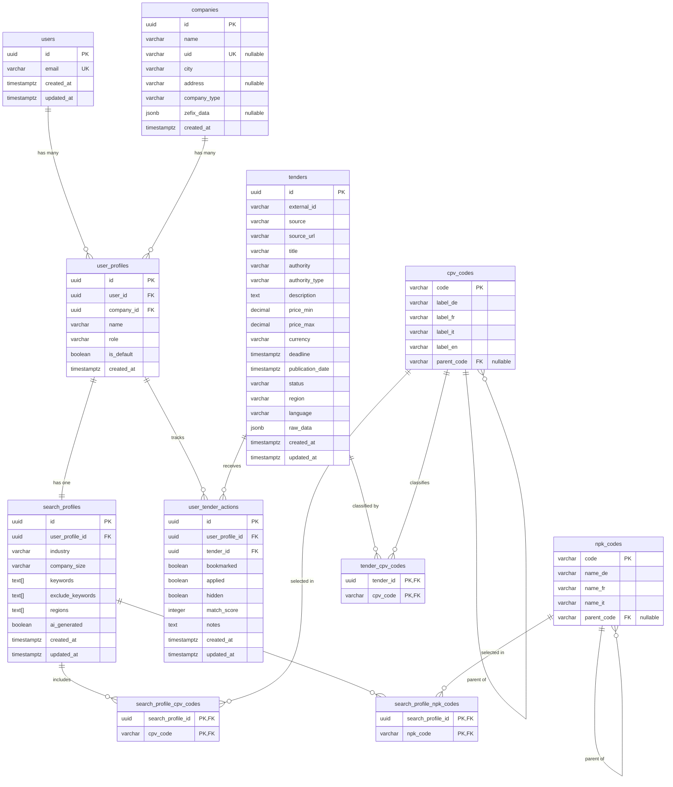

# Database Design - Tender Scout

## Overview

This document defines the conceptual data model for Tender Scout, designed for implementation with **Supabase** (PostgreSQL + Auth + Storage + Realtime).

---

## Conceptual Data Model

### Entity Relationship Diagram



---

## Entities

### 1. users

Managed by **Supabase Auth**. Extended with a profiles table if additional user metadata is needed.

| Attribute    | Type        | Description                          |
|--------------|-------------|--------------------------------------|
| id           | UUID (PK)   | Supabase Auth user ID                |
| email        | VARCHAR     | User's email (unique)                |
| created_at   | TIMESTAMPTZ | Account creation timestamp           |
| updated_at   | TIMESTAMPTZ | Last update timestamp                |

**Notes:**
- Authentication handled by Supabase Auth (email/password, OAuth)
- Additional profile data (name, avatar) can be stored in a separate `user_metadata` table or Supabase's built-in `raw_user_meta_data`

---

### 2. companies

Swiss companies identified via Zefix or manually entered.

| Attribute    | Type        | Description                          |
|--------------|-------------|--------------------------------------|
| id           | UUID (PK)   | Unique identifier                    |
| name         | VARCHAR     | Company name                         |
| uid          | VARCHAR     | Swiss UID (CHE-xxx.xxx.xxx), nullable|
| city         | VARCHAR     | City/location                        |
| address      | VARCHAR     | Street address, nullable             |
| company_type | VARCHAR     | Legal form (AG, GmbH, etc.)          |
| zefix_data   | JSONB       | Raw Zefix API response, nullable     |
| created_at   | TIMESTAMPTZ | Record creation timestamp            |

**Notes:**
- `uid` is unique when present but nullable for manually entered companies
- `zefix_data` stores the complete API response for reference

---

### 3. user_profiles

Links users to companies with role information. A user can have multiple profiles (e.g., consultant working with multiple companies).

| Attribute    | Type        | Description                          |
|--------------|-------------|--------------------------------------|
| id           | UUID (PK)   | Unique identifier                    |
| user_id      | UUID (FK)   | Reference to users                   |
| company_id   | UUID (FK)   | Reference to companies               |
| name         | VARCHAR     | Profile display name                 |
| role         | VARCHAR     | User's role at company               |
| is_default   | BOOLEAN     | Default profile for this user        |
| created_at   | TIMESTAMPTZ | Record creation timestamp            |

**Constraints:**
- Unique constraint on (user_id, company_id)
- Only one `is_default = true` per user_id

---

### 4. search_profiles

AI-generated or user-defined search criteria for tender matching.

| Attribute        | Type        | Description                          |
|------------------|-------------|--------------------------------------|
| id               | UUID (PK)   | Unique identifier                    |
| user_profile_id  | UUID (FK)   | Reference to user_profiles           |
| industry         | VARCHAR     | Industry category                    |
| company_size     | VARCHAR     | Size range (1-9, 10-49, 50-249)      |
| keywords         | TEXT[]      | Positive matching keywords           |
| exclude_keywords | TEXT[]      | Negative/exclusion keywords          |
| regions          | TEXT[]      | Target regions (cantons/countries)   |
| ai_generated     | BOOLEAN     | Whether AI created this profile      |
| created_at       | TIMESTAMPTZ | Record creation timestamp            |
| updated_at       | TIMESTAMPTZ | Last modification timestamp          |

**Notes:**
- One-to-one relationship with user_profiles (each profile has one search configuration)
- CPV and NPK codes stored in junction tables for proper normalization

---

### 5. tenders

Public procurement opportunities from SIMAP, TED, and other sources.

| Attribute      | Type        | Description                          |
|----------------|-------------|--------------------------------------|
| id             | UUID (PK)   | Unique identifier                    |
| external_id    | VARCHAR     | Source system ID (SIMAP/TED ref)     |
| source         | VARCHAR     | Origin: 'simap', 'ted', 'eu'         |
| source_url     | VARCHAR     | Link to original tender              |
| title          | VARCHAR     | Tender title                         |
| authority      | VARCHAR     | Contracting authority name           |
| authority_type | VARCHAR     | Type: municipal, cantonal, federal   |
| description    | TEXT        | Full tender description              |
| price_min      | DECIMAL     | Minimum estimated value (CHF)        |
| price_max      | DECIMAL     | Maximum estimated value (CHF)        |
| currency       | VARCHAR     | Currency code (CHF, EUR)             |
| deadline       | TIMESTAMPTZ | Submission deadline                  |
| publication_date| TIMESTAMPTZ| When tender was published            |
| status         | VARCHAR     | 'open', 'closing_soon', 'closed'     |
| region         | VARCHAR     | Primary region/canton                |
| language       | VARCHAR     | Primary language (de, fr, it, en)    |
| raw_data       | JSONB       | Original API response                |
| created_at     | TIMESTAMPTZ | Record creation timestamp            |
| updated_at     | TIMESTAMPTZ | Last sync timestamp                  |

**Notes:**
- `external_id` + `source` should be unique (prevents duplicate imports)
- `raw_data` preserves original data for debugging and future parsing improvements
- CPV codes stored in junction table

---

### 6. user_tender_actions

Tracks user interactions with tenders (bookmark, apply, hide).

| Attribute       | Type        | Description                          |
|-----------------|-------------|--------------------------------------|
| id              | UUID (PK)   | Unique identifier                    |
| user_profile_id | UUID (FK)   | Reference to user_profiles           |
| tender_id       | UUID (FK)   | Reference to tenders                 |
| bookmarked      | BOOLEAN     | User bookmarked this tender          |
| applied         | BOOLEAN     | User marked as applied               |
| hidden          | BOOLEAN     | User hid this tender                 |
| match_score     | INTEGER     | Calculated match percentage (0-100)  |
| notes           | TEXT        | User's private notes                 |
| created_at      | TIMESTAMPTZ | First interaction timestamp          |
| updated_at      | TIMESTAMPTZ | Last action timestamp                |

**Constraints:**
- Unique constraint on (user_profile_id, tender_id)

---

### 7. cpv_codes

EU Common Procurement Vocabulary - hierarchical classification system.

| Attribute   | Type        | Description                          |
|-------------|-------------|--------------------------------------|
| code        | VARCHAR (PK)| CPV code (e.g., '45210000')          |
| label_de    | VARCHAR     | German label                         |
| label_fr    | VARCHAR     | French label                         |
| label_it    | VARCHAR     | Italian label                        |
| label_en    | VARCHAR     | English label                        |
| parent_code | VARCHAR (FK)| Parent CPV code for hierarchy        |

**Notes:**
- Self-referencing for hierarchical structure
- Codes are standardized EU-wide

---

### 8. npk_codes

Swiss construction standards (Normpositionen-Katalog).

| Attribute   | Type        | Description                          |
|-------------|-------------|--------------------------------------|
| code        | VARCHAR (PK)| NPK code (e.g., '211')               |
| name_de     | VARCHAR     | German name                          |
| name_fr     | VARCHAR     | French name                          |
| name_it     | VARCHAR     | Italian name                         |
| parent_code | VARCHAR (FK)| Parent code for hierarchy            |

---

### Junction Tables

#### search_profile_cpv_codes
Links search profiles to their selected CPV codes.

| Attribute         | Type        |
|-------------------|-------------|
| search_profile_id | UUID (FK)   |
| cpv_code          | VARCHAR (FK)|

#### search_profile_npk_codes
Links search profiles to their selected NPK codes.

| Attribute         | Type        |
|-------------------|-------------|
| search_profile_id | UUID (FK)   |
| npk_code          | VARCHAR (FK)|

#### tender_cpv_codes
Links tenders to their CPV classification codes.

| Attribute  | Type        |
|------------|-------------|
| tender_id  | UUID (FK)   |
| cpv_code   | VARCHAR (FK)|

---

## Relationships Summary

| Relationship                      | Type        | Description                              |
|-----------------------------------|-------------|------------------------------------------|
| users → user_profiles             | 1:N         | User can have multiple company profiles  |
| companies → user_profiles         | 1:N         | Company can have multiple users          |
| user_profiles → search_profiles   | 1:1         | Each profile has one search config       |
| user_profiles → user_tender_actions| 1:N        | Profile tracks many tender interactions  |
| tenders → user_tender_actions     | 1:N         | Tender can be acted on by many profiles  |
| search_profiles ↔ cpv_codes       | N:M         | Many-to-many via junction table          |
| search_profiles ↔ npk_codes       | N:M         | Many-to-many via junction table          |
| tenders ↔ cpv_codes               | N:M         | Many-to-many via junction table          |

---

## Supabase-Specific Considerations

### Authentication
- Use Supabase Auth for user management
- Support email/password + OAuth providers (Google, Microsoft)
- Row Level Security (RLS) policies based on `auth.uid()`

### Row Level Security (RLS) Policies

```
-- Users can only see their own profiles
user_profiles: auth.uid() = user_id

-- Users can only see/modify their own search profiles
search_profiles: user_profile_id IN (SELECT id FROM user_profiles WHERE user_id = auth.uid())

-- Users can only see/modify their own tender actions
user_tender_actions: user_profile_id IN (SELECT id FROM user_profiles WHERE user_id = auth.uid())

-- Tenders are readable by all authenticated users
tenders: auth.role() = 'authenticated'

-- Code tables are readable by all
cpv_codes, npk_codes: true (public read)
```

### Realtime Subscriptions
- Subscribe to `tenders` for new tender notifications
- Subscribe to `user_tender_actions` for cross-device sync

### Storage
- User avatars in `avatars` bucket
- Company logos in `company-logos` bucket
- Tender attachments in `tender-documents` bucket (future)

### Edge Functions
- `calculate-match-score`: Compute tender-profile match scores
- `sync-simap`: Fetch new tenders from SIMAP API
- `sync-ted`: Fetch new tenders from TED API

---

## Data Flow

```
1. User Registration
   Supabase Auth → users (automatic)

2. Company Selection
   Zefix API → companies (if new)
   User selects → user_profiles created

3. AI Profile Generation
   Company data → AI analysis → search_profiles
   User edits → search_profile_cpv_codes, search_profile_npk_codes

4. Tender Sync (Background Job)
   SIMAP/TED APIs → tenders, tender_cpv_codes

5. Tender Matching
   search_profiles + tenders → match_score calculation
   Results displayed in dashboard

6. User Actions
   Bookmark/Apply/Hide → user_tender_actions
```

---

## Future Considerations

### Phase 2 Additions
- `applications` table - Track actual bid submissions
- `tender_updates` table - Version history for tender changes
- `notifications` table - User notification preferences and history

### Phase 3 Additions
- `competitors` table - Competitor tracking
- `bid_history` table - Historical bid outcomes for win probability
- `tender_analytics` table - Aggregated statistics

---

## Revision History

| Date       | Version | Changes                    |
|------------|---------|----------------------------|
| 2026-01-18 | 0.1     | Initial conceptual model   |
