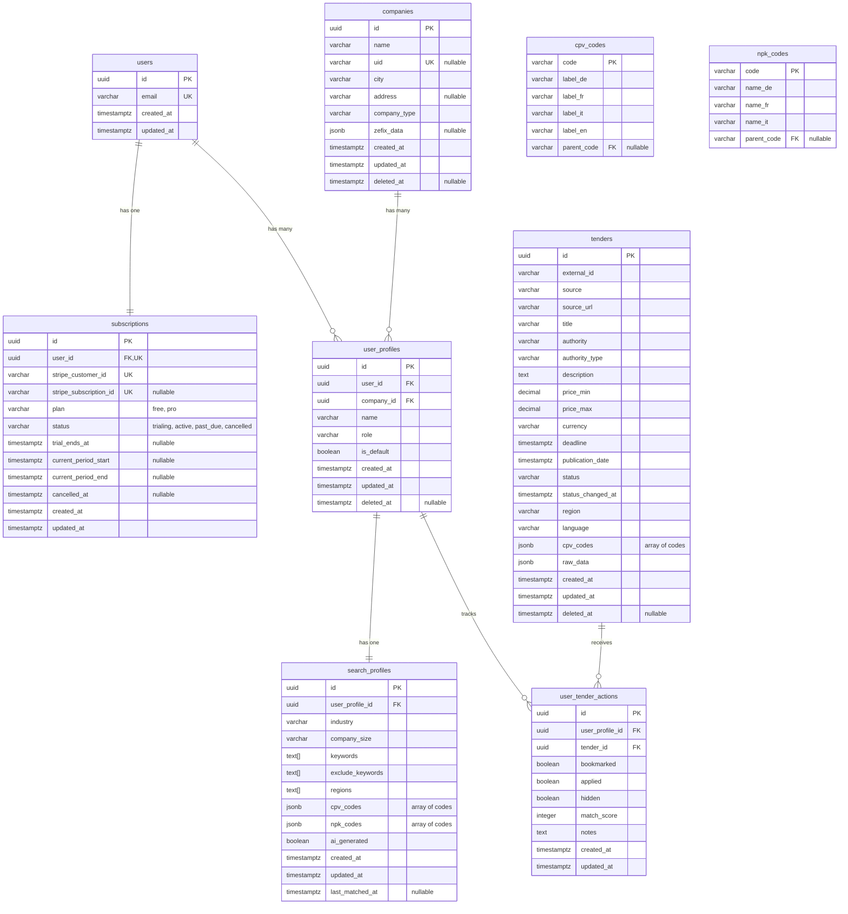
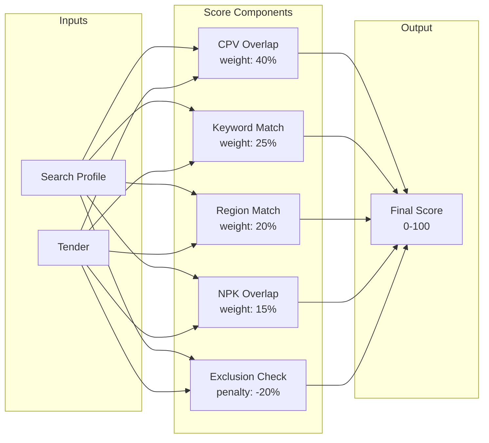
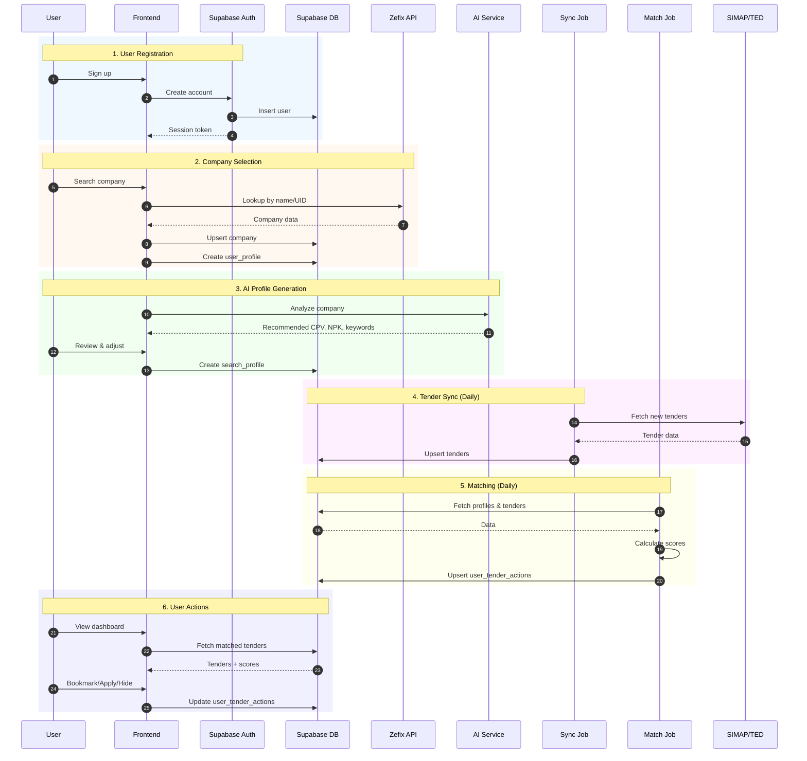
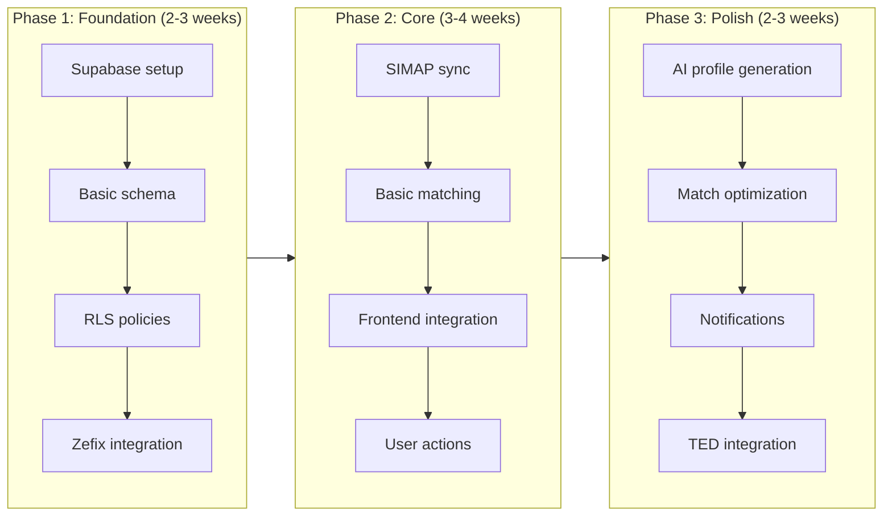

# Database Design - Tender Scout

## Overview

This document defines the data model for Tender Scout at three levels of abstraction:

| Level | Purpose | Contents |
|-------|---------|----------|
| **Conceptual** | Business view | Entity overview, high-level relationships |
| **Logical** | Design view | ERD with attributes, data types, keys, cardinality |
| **Physical** | Implementation view | Indexes, constraints, Supabase-specific configuration |

**Target Platform:** Supabase (PostgreSQL + Auth + Storage + Realtime)

---

## Conceptual Data Model

High-level business view of the data entities and their purpose.

| Entity | Type | Description |
|--------|------|-------------|
| **users** | Core | User accounts managed by Supabase Auth |
| **subscriptions** | Core | Stripe subscription status and billing (free/pro tiers) |
| **companies** | Core | Swiss companies identified via Zefix or manual entry |
| **user_profiles** | Core | Links users to companies with role information |
| **search_profiles** | Core | AI-generated or user-defined tender matching criteria |
| **tenders** | Core | Public procurement opportunities from SIMAP/TED |
| **user_tender_actions** | Core | Tracks user interactions and match scores |
| **cpv_codes** | Lookup | EU Common Procurement Vocabulary (hierarchical) |
| **npk_codes** | Lookup | Swiss construction standards (hierarchical) |

### High-Level Relationships

```
Users ──┬── Subscriptions (1:1)
        │
        ├── Companies          Tenders
        │                         │
        ▼                         │
   User Profiles ◄────────────────┘
        │                    (via user_tender_actions)
        ▼
   Search Profiles ◄─── CPV/NPK Codes (lookup)
```

- A **User** has one **Subscription** (free tier with 14-day Pro trial, or paid Pro)
- A **User** can have multiple **User Profiles** (one per company)
- **Free tier:** Limited to 1 search profile | **Pro tier:** Unlimited
- Each **User Profile** has one **Search Profile** (matching criteria)
- **Tenders** are matched to **Search Profiles** via the matching algorithm
- Results stored in **User Tender Actions** with match scores

---

## Logical Data Model

Detailed design view with attributes, data types, keys, and cardinality.

### Entity Relationship Diagram



---

### Entity Specifications

#### 1. users

Managed by **Supabase Auth**. Extended with a profiles table if additional user metadata is needed.

| Attribute    | Type        | Description                          |
|--------------|-------------|--------------------------------------|
| id           | UUID (PK)   | Supabase Auth user ID                |
| email        | VARCHAR     | User's email (unique)                |
| created_at   | TIMESTAMPTZ | Account creation timestamp           |
| updated_at   | TIMESTAMPTZ | Last update timestamp                |

**Notes:**
- Authentication handled by Supabase Auth (email/password, OAuth)
- SSO providers (Google, Microsoft) handled natively by Supabase Auth - no additional schema needed
- Additional profile data (name, avatar) can be stored in a separate `user_metadata` table or Supabase's built-in `raw_user_meta_data`

---

#### 2. subscriptions

Tracks Stripe subscription status for billing and feature entitlements.

| Attribute              | Type        | Description                          |
|------------------------|-------------|--------------------------------------|
| id                     | UUID (PK)   | Unique identifier                    |
| user_id                | UUID (FK)   | Reference to users (unique)          |
| stripe_customer_id     | VARCHAR     | Stripe customer ID (unique)          |
| stripe_subscription_id | VARCHAR     | Stripe subscription ID, nullable     |
| plan                   | VARCHAR     | 'free' or 'pro'                      |
| status                 | VARCHAR     | 'trialing', 'active', 'past_due', 'cancelled' |
| trial_ends_at          | TIMESTAMPTZ | End of 14-day Pro trial, nullable    |
| current_period_start   | TIMESTAMPTZ | Billing period start, nullable       |
| current_period_end     | TIMESTAMPTZ | Billing period end, nullable         |
| cancelled_at           | TIMESTAMPTZ | When subscription was cancelled      |
| created_at             | TIMESTAMPTZ | Record creation timestamp            |
| updated_at             | TIMESTAMPTZ | Last update timestamp                |

**Subscription Tiers:**

| Tier | Search Profiles | Trial | Price |
|------|-----------------|-------|-------|
| **Free** | 1 | - | CHF 0 |
| **Pro** | Unlimited | 14 days | TBD |

**Notes:**
- One subscription per user (1:1 relationship)
- New users start with `plan='pro'`, `status='trialing'`, `trial_ends_at=NOW()+14 days`
- After trial ends without payment: `plan='free'`, `status='active'`
- Stripe webhooks update this table on subscription changes
- Feature limits enforced in application layer based on `plan`

**Stripe Webhook Events:**
- `customer.subscription.created` → Insert/update subscription
- `customer.subscription.updated` → Update status, period dates
- `customer.subscription.deleted` → Set `cancelled_at`, `status='cancelled'`
- `invoice.payment_failed` → Set `status='past_due'`

---

#### 3. companies

Swiss companies identified via Zefix or manually entered.

| Attribute    | Type        | Description                          |
|--------------|-------------|--------------------------------------|
| id           | UUID (PK)   | Unique identifier                    |
| name         | VARCHAR     | Company name                         |
| uid          | VARCHAR     | Swiss UID (CHE-xxx.xxx.xxx), nullable|
| city         | VARCHAR     | City/location                        |
| address      | VARCHAR     | Street address, nullable             |
| company_type | VARCHAR     | Legal form (AG, GmbH, etc.)          |
| zefix_data   | JSONB       | Raw Zefix API response, nullable     |
| created_at   | TIMESTAMPTZ | Record creation timestamp            |
| updated_at   | TIMESTAMPTZ | Last update timestamp                |
| deleted_at   | TIMESTAMPTZ | Soft delete timestamp, nullable      |

**Notes:**
- `uid` is unique when present but nullable for manually entered companies
- `zefix_data` stores the complete API response for reference
- Soft delete via `deleted_at` - filter with `WHERE deleted_at IS NULL`

---

#### 4. user_profiles

Links users to companies with role information. A user can have multiple profiles (e.g., consultant working with multiple companies).

| Attribute    | Type        | Description                          |
|--------------|-------------|--------------------------------------|
| id           | UUID (PK)   | Unique identifier                    |
| user_id      | UUID (FK)   | Reference to users                   |
| company_id   | UUID (FK)   | Reference to companies               |
| name         | VARCHAR     | Profile display name                 |
| role         | VARCHAR     | User's role at company               |
| is_default   | BOOLEAN     | Default profile for this user        |
| created_at   | TIMESTAMPTZ | Record creation timestamp            |
| updated_at   | TIMESTAMPTZ | Last update timestamp                |
| deleted_at   | TIMESTAMPTZ | Soft delete timestamp, nullable      |

**Constraints:**
- Unique constraint on (user_id, company_id)
- Only one `is_default = true` per user_id
- Soft delete via `deleted_at` - filter with `WHERE deleted_at IS NULL`

---

#### 5. search_profiles

AI-generated or user-defined search criteria for tender matching.

| Attribute        | Type        | Description                          |
|------------------|-------------|--------------------------------------|
| id               | UUID (PK)   | Unique identifier                    |
| user_profile_id  | UUID (FK)   | Reference to user_profiles           |
| industry         | VARCHAR     | Industry category                    |
| company_size     | VARCHAR     | Size range (1-9, 10-49, 50-249)      |
| keywords         | TEXT[]      | Positive matching keywords           |
| exclude_keywords | TEXT[]      | Negative/exclusion keywords          |
| regions          | TEXT[]      | Target regions (cantons/countries)   |
| cpv_codes        | JSONB       | Selected CPV codes `["45210000", ...]` |
| npk_codes        | JSONB       | Selected NPK codes `["211", ...]`    |
| ai_generated     | BOOLEAN     | Whether AI created this profile      |
| created_at       | TIMESTAMPTZ | Record creation timestamp            |
| updated_at       | TIMESTAMPTZ | Last modification timestamp          |
| last_matched_at  | TIMESTAMPTZ | Last time matching job ran, nullable |

**Notes:**
- One-to-one relationship with user_profiles (each profile has one search configuration)
- CPV/NPK codes stored as JSONB arrays for simpler reads and atomic updates
- `last_matched_at` tracks freshness for incremental matching optimization
- NPK codes are Swiss construction-specific; matched via CPV→NPK mapping (see Matching Algorithm)

---

#### 6. tenders

Public procurement opportunities from SIMAP, TED, and other sources.

| Attribute        | Type        | Description                          |
|------------------|-------------|--------------------------------------|
| id               | UUID (PK)   | Unique identifier                    |
| external_id      | VARCHAR     | Source system ID (SIMAP/TED ref)     |
| source           | VARCHAR     | Origin: 'simap', 'ted', 'eu'         |
| source_url       | VARCHAR     | Link to original tender              |
| title            | VARCHAR     | Tender title                         |
| authority        | VARCHAR     | Contracting authority name           |
| authority_type   | VARCHAR     | Type: municipal, cantonal, federal   |
| description      | TEXT        | Full tender description              |
| price_min        | DECIMAL     | Minimum estimated value (CHF)        |
| price_max        | DECIMAL     | Maximum estimated value (CHF)        |
| currency         | VARCHAR     | Currency code (CHF, EUR)             |
| deadline         | TIMESTAMPTZ | Submission deadline                  |
| publication_date | TIMESTAMPTZ | When tender was published            |
| status           | VARCHAR     | 'open', 'closing_soon', 'closed'     |
| status_changed_at| TIMESTAMPTZ | When status last changed             |
| region           | VARCHAR     | Primary region/canton                |
| language         | VARCHAR     | Primary language (de, fr, it, en)    |
| cpv_codes        | JSONB       | CPV classification codes `["45210000", ...]` |
| raw_data         | JSONB       | Original API response                |
| created_at       | TIMESTAMPTZ | Record creation timestamp            |
| updated_at       | TIMESTAMPTZ | Last sync timestamp                  |
| deleted_at       | TIMESTAMPTZ | Soft delete timestamp, nullable      |

**Notes:**
- `external_id` + `source` should be unique (prevents duplicate imports)
- `raw_data` preserves original data for debugging and future parsing improvements
- CPV codes stored as JSONB array for simpler matching queries
- Status auto-transitions via scheduled job: `open` → `closing_soon` (7 days before deadline) → `closed` (after deadline)
- Soft delete via `deleted_at` - filter with `WHERE deleted_at IS NULL`

---

#### 7. user_tender_actions

Tracks user interactions with tenders (bookmark, apply, hide).

| Attribute       | Type        | Description                          |
|-----------------|-------------|--------------------------------------|
| id              | UUID (PK)   | Unique identifier                    |
| user_profile_id | UUID (FK)   | Reference to user_profiles           |
| tender_id       | UUID (FK)   | Reference to tenders                 |
| bookmarked      | BOOLEAN     | User bookmarked this tender          |
| applied         | BOOLEAN     | User marked as applied               |
| hidden          | BOOLEAN     | User hid this tender                 |
| match_score     | INTEGER     | Calculated match percentage (0-100)  |
| notes           | TEXT        | User's private notes                 |
| created_at      | TIMESTAMPTZ | First interaction timestamp          |
| updated_at      | TIMESTAMPTZ | Last action timestamp                |

**Constraints:**
- Unique constraint on (user_profile_id, tender_id)

---

#### 8. cpv_codes

EU Common Procurement Vocabulary - hierarchical classification system.

| Attribute   | Type        | Description                          |
|-------------|-------------|--------------------------------------|
| code        | VARCHAR (PK)| CPV code (e.g., '45210000')          |
| label_de    | VARCHAR     | German label                         |
| label_fr    | VARCHAR     | French label                         |
| label_it    | VARCHAR     | Italian label                        |
| label_en    | VARCHAR     | English label                        |
| parent_code | VARCHAR (FK)| Parent CPV code for hierarchy        |

**Notes:**
- Self-referencing for hierarchical structure
- Codes are standardized EU-wide

---

#### 9. npk_codes

Swiss construction standards (Normpositionen-Katalog).

| Attribute   | Type        | Description                          |
|-------------|-------------|--------------------------------------|
| code        | VARCHAR (PK)| NPK code (e.g., '211')               |
| name_de     | VARCHAR     | German name                          |
| name_fr     | VARCHAR     | French name                          |
| name_it     | VARCHAR     | Italian name                         |
| parent_code | VARCHAR (FK)| Parent code for hierarchy            |

---

### Relationships Summary

| Relationship                      | Type        | Description                              |
|-----------------------------------|-------------|------------------------------------------|
| users → subscriptions             | 1:1         | User has one subscription (free or pro)  |
| users → user_profiles             | 1:N         | User can have multiple company profiles  |
| companies → user_profiles         | 1:N         | Company can have multiple users          |
| user_profiles → search_profiles   | 1:1         | Each profile has one search config       |
| user_profiles → user_tender_actions| 1:N        | Profile tracks many tender interactions  |
| tenders → user_tender_actions     | 1:N         | Tender can be acted on by many profiles  |

**Notes:**
- CPV/NPK codes stored as JSONB arrays (not junction tables) for simpler reads and atomic updates
- Subscription limits (free: 1 search profile, pro: unlimited) enforced in application layer

---

## Physical Data Model

Implementation details for PostgreSQL/Supabase deployment.

### Indexes

#### Primary Indexes (auto-created)
- All primary keys (UUID) are automatically indexed
- Unique constraints create indexes on `users.email`, `companies.uid`

#### Recommended Performance Indexes

```sql
-- Tender queries (dashboard, filtering)
CREATE INDEX idx_tenders_status_deadline ON tenders(status, deadline)
    WHERE deleted_at IS NULL;
CREATE INDEX idx_tenders_region ON tenders(region)
    WHERE deleted_at IS NULL;
CREATE INDEX idx_tenders_cpv_gin ON tenders USING GIN(cpv_codes);

-- Search profile queries
CREATE INDEX idx_search_profiles_cpv_gin ON search_profiles USING GIN(cpv_codes);
CREATE INDEX idx_search_profiles_npk_gin ON search_profiles USING GIN(npk_codes);
CREATE INDEX idx_search_profiles_last_matched ON search_profiles(last_matched_at);

-- User tender actions (dashboard, filtering)
CREATE INDEX idx_actions_profile_score ON user_tender_actions(user_profile_id, match_score DESC);
CREATE INDEX idx_actions_profile_status ON user_tender_actions(user_profile_id, bookmarked, applied, hidden);
CREATE INDEX idx_actions_tender ON user_tender_actions(tender_id);

-- Soft delete filters
CREATE INDEX idx_companies_active ON companies(id) WHERE deleted_at IS NULL;
CREATE INDEX idx_user_profiles_active ON user_profiles(user_id) WHERE deleted_at IS NULL;
CREATE INDEX idx_tenders_active ON tenders(id) WHERE deleted_at IS NULL;

-- Subscription queries
CREATE UNIQUE INDEX idx_subscriptions_user ON subscriptions(user_id);
CREATE UNIQUE INDEX idx_subscriptions_stripe_customer ON subscriptions(stripe_customer_id);
CREATE INDEX idx_subscriptions_status ON subscriptions(status);
CREATE INDEX idx_subscriptions_trial_ends ON subscriptions(trial_ends_at) WHERE status = 'trialing';

-- Lookup tables (hierarchy queries)
CREATE INDEX idx_cpv_parent ON cpv_codes(parent_code);
CREATE INDEX idx_npk_parent ON npk_codes(parent_code);
```

#### Index Notes
- GIN indexes on JSONB enable fast `@>`, `?`, `?|` operators for code matching
- Partial indexes with `WHERE deleted_at IS NULL` optimize active record queries
- Composite indexes ordered by selectivity (status before deadline)

---

### Supabase Configuration

#### Authentication
- Use Supabase Auth for user management
- Support email/password + OAuth providers (Google, Microsoft)
- Row Level Security (RLS) policies based on `auth.uid()`

#### Row Level Security (RLS) Policies

```sql
-- Users can only see their own profiles
user_profiles: auth.uid() = user_id

-- Users can only see/modify their own search profiles
search_profiles: user_profile_id IN (SELECT id FROM user_profiles WHERE user_id = auth.uid())

-- Users can only see/modify their own tender actions
user_tender_actions: user_profile_id IN (SELECT id FROM user_profiles WHERE user_id = auth.uid())

-- Tenders are readable by all authenticated users
tenders: auth.role() = 'authenticated'

-- Code tables are readable by all
cpv_codes, npk_codes: true (public read)
```

#### Realtime Subscriptions
- Subscribe to `tenders` for new tender notifications
- Subscribe to `user_tender_actions` for cross-device sync

#### Storage Buckets
- User avatars in `avatars` bucket
- Company logos in `company-logos` bucket
- Tender attachments in `tender-documents` bucket (future)

#### Edge Functions
- `sync-simap`: Fetch new tenders from SIMAP API
- `sync-ted`: Fetch new tenders from TED API

---

## Matching Algorithm

### Overview

Match scores are calculated by a **Python batch job** that runs:
1. **On-demand:** When a user completes or updates their search profile
2. **Scheduled:** Daily, when new tenders are synced from SIMAP/TED

### Architecture


### Score Calculation Flow



### Matching Criteria

| Criterion | Weight | Logic | Example |
|-----------|--------|-------|---------|
| **CPV overlap** | 40% | `len(profile ∩ tender) / len(profile)` | Profile has 5 CPV, tender matches 3 → 60% × 40 = 24 pts |
| **Keyword match** | 25% | Keywords found in title/description | 4 of 6 keywords found → 67% × 25 = 17 pts |
| **Region match** | 20% | Tender region in profile regions | Exact match → 100% × 20 = 20 pts |
| **NPK overlap** | 15% | Same as CPV, for construction | 2 of 4 NPK match → 50% × 15 = 8 pts |
| **Exclusion penalty** | -20% | Any exclude_keyword found | 1 exclusion found → -20 pts |

**Score formula:**
```
score = (cpv_score × 0.40) + (keyword_score × 0.25) + (region_score × 0.20) + (npk_score × 0.15) - exclusion_penalty
score = max(0, min(100, score))
```

### Pseudocode

```python
def calculate_match_score(profile: SearchProfile, tender: Tender) -> int:
    score = 0

    # CPV overlap (40%)
    if profile.cpv_codes and tender.cpv_codes:
        overlap = set(profile.cpv_codes) & set(tender.cpv_codes)
        cpv_ratio = len(overlap) / len(profile.cpv_codes)
        score += cpv_ratio * 40

    # Keyword matching (25%)
    text = f"{tender.title} {tender.description}".lower()
    if profile.keywords:
        matches = sum(1 for kw in profile.keywords if kw.lower() in text)
        kw_ratio = matches / len(profile.keywords)
        score += kw_ratio * 25

    # Region match (20%)
    if tender.region in profile.regions:
        score += 20

    # NPK overlap (15%) - construction tenders only
    if profile.npk_codes and tender.cpv_codes:
        # Map CPV to NPK or check NPK directly
        npk_overlap = calculate_npk_overlap(profile, tender)
        score += npk_overlap * 15

    # Exclusion penalty (-20%)
    if profile.exclude_keywords:
        for ex in profile.exclude_keywords:
            if ex.lower() in text:
                score -= 20
                break

    return max(0, min(100, int(score)))
```

### Execution Modes

| Mode | Trigger | Scope | Frequency |
|------|---------|-------|-----------|
| **Full sync** | Daily cron | All profiles × all open tenders | Once per day |
| **Incremental** | New tender webhook | All profiles × new tender | Per tender |
| **Profile update** | User saves profile | Single profile × all open tenders | On demand |

### Why Python?

- **Experimentation:** Easy to tweak scoring weights and logic
- **NLP potential:** spaCy, scikit-learn for smarter keyword matching
- **Local testing:** Run against test data without deployment
- **Scheduling:** cron, GitHub Actions, or cloud scheduler (Cloud Run, Lambda)
- **Supabase integration:** `supabase-py` client for database access

---

## Data Flow



---

## Expert Review

### Strengths

| Area | Assessment |
|------|------------|
| **Schema simplicity** | Clean 8-table design; JSONB arrays reduce complexity |
| **Supabase fit** | Good use of Auth, RLS, Realtime capabilities |
| **Separation of concerns** | User data, tenders, and matching cleanly separated |
| **Audit trail** | `created_at`/`updated_at` on all tables |
| **Multilingual support** | Labels in DE/FR/IT/EN for lookup tables |

### Concerns & Resolutions

| # | Concern | Status | Resolution |
|---|---------|--------|------------|
| 1 | Scalability of matching | ✅ Addressed | Added `last_matched_at` to `search_profiles` for incremental matching |
| 2 | Missing indexes | ✅ Addressed | Added comprehensive Indexes section with GIN, composite, and partial indexes |
| 3 | JSONB data integrity | ⚠️ Documented | Validate in application layer; trade-off for schema simplicity |
| 4 | Status management | ✅ Addressed | Added `status_changed_at` to `tenders`; auto-transition via scheduled job |
| 5 | Missing `updated_at` | ✅ Addressed | Added `updated_at` to `companies` and `user_profiles` |
| 6 | NPK matching unclear | ✅ Addressed | Documented: NPK matched via CPV→NPK mapping in matching algorithm |
| 7 | No soft delete | ✅ Addressed | Added `deleted_at` to `companies`, `user_profiles`, and `tenders` |

### Remaining Considerations

#### JSONB Validation Trade-off
CPV/NPK codes in JSONB arrays are **not** FK-validated against lookup tables. This is an intentional trade-off:
- **Pro:** Simpler schema, faster writes, atomic updates
- **Con:** Invalid codes won't be caught by database
- **Mitigation:** Validate in application layer before insert; use lookup tables for autocomplete

---

## Difficulty Estimation

### Implementation Complexity by Component

| Component | Difficulty | Effort | Notes |
|-----------|------------|--------|-------|
| **Supabase setup** | Low | 1-2 days | Tables, RLS, Auth config |
| **Stripe integration** | Medium | 3-4 days | Checkout, webhooks, customer portal |
| **Subscription management** | Low | 1-2 days | Trial logic, tier enforcement |
| **Zefix API integration** | Low | 1-2 days | Simple REST API |
| **SIMAP API integration** | Medium | 3-5 days | May require scraping if no clean API |
| **TED API integration** | Medium | 3-5 days | OAuth, pagination, rate limits |
| **AI profile generation** | Medium | 2-3 days | Prompt engineering, LLM integration |
| **Matching algorithm (basic)** | Low | 2-3 days | As documented, straightforward |
| **Matching algorithm (optimized)** | Medium | 5-7 days | Pre-filtering, caching, batching |
| **Frontend integration** | Medium | 5-7 days | Assuming existing vanilla JS app |
| **Notifications** | Medium | 3-4 days | Email/push for high-match tenders |
| **Testing & validation** | Medium | 3-5 days | Match quality tuning, edge cases |

### Risk Assessment

| Risk | Likelihood | Impact | Mitigation |
|------|------------|--------|------------|
| SIMAP API changes/unavailable | Medium | High | Cache responses, fallback to scraping |
| Match score quality | Medium | Medium | A/B testing, user feedback loop |
| Scale beyond Supabase free tier | Low | Medium | Monitor usage, plan for Pro tier |
| CPV code hierarchy complexity | Low | Low | Start with exact match, add hierarchy later |
| Multilingual keyword matching | Medium | Medium | Start DE-only, add languages incrementally |

### Recommended Implementation Order



### Total Estimate

| Scenario | Duration | Team Size |
|----------|----------|-----------|
| **MVP (SIMAP only, basic matching)** | 4-6 weeks | 1 developer |
| **Full Phase 1-3** | 8-12 weeks | 1-2 developers |
| **With TED + advanced NLP** | 12-16 weeks | 2 developers |

---

## Future Considerations

### Phase 2 Additions
- `applications` table - Track actual bid submissions
- `tender_updates` table - Version history for tender changes
- `notifications` table - User notification preferences and history

### Phase 3 Additions
- `competitors` table - Competitor tracking
- `bid_history` table - Historical bid outcomes for win probability
- `tender_analytics` table - Aggregated statistics

---

## Revision History

| Date       | Version | Changes                    |
|------------|---------|----------------------------|
| 2026-01-18 | 0.7     | Add subscriptions table for Stripe billing (free/pro tiers, 14-day trial) |
| 2026-01-18 | 0.6     | Restructure document: separate Conceptual, Logical, and Physical data models |
| 2026-01-18 | 0.5     | Address expert review: add indexes, soft delete, status management, updated_at fields |
| 2026-01-18 | 0.4     | Add Mermaid data flow diagram, expert review, and difficulty estimation |
| 2026-01-18 | 0.3     | Add detailed Mermaid flowcharts for matching algorithm |
| 2026-01-18 | 0.2     | Replace junction tables with JSONB arrays; add matching algorithm section |
| 2026-01-18 | 0.1     | Initial conceptual model   |
